<p align="center">
  
</p>

<h3 align="center">Interactively browse, filter, and bulk-delete git branches from a fast terminal UI.</h3>

<p align="center">
  <a href="https://pypi.org/project/git-cleaner-tui/"></a>
  
  
  
</p>

---

## Install

```bash
uv tool install git-cleaner-tui
git-cleaner-tui
```

Or from source:

```bash
git clone https://github.com/Allentgt/Git-Cleaner
cd git-cleaner
uv sync
uv run git-cleaner-tui --repo /path/to/repo
```

Requires Python ≥ 3.11, [uv](https://docs.astral.sh/uv/) (or pip), and a git repository.

---

## Features

| | Feature | Details |
|---|---------|---------|
| 🌳 | **Tree view** | Branches grouped by prefix (`feature/`, `bugfix/`, …) with ahead/behind tracking |
| 📅 | **Date filtering** | Calendar picker or presets: 7d, 30d, 90d, 1y |
| 🛡️ | **Protection** | `main`/`master`/`develop` + custom patterns; cannot be selected |
| ⛔ | **Blacklist** | Wildcard patterns (`archive/*`); hidden by default |
| ☁️ | **Remote deletion** | Toggle `r` to also `git push origin --delete` |
| 🧪 | **Dry run** | Preview deletions without executing |
| ↩️ | **Undo** | Press `u` to restore the last batch via reflog |
| 📥 | **Export** | Download filtered branch list as CSV or JSON |
| 🔧 | **Maintenance** | GC, Repack, Prune, Reflog expiry — one click |
| 📦 | **Stash browser** | List, drop, apply, pop stashes |
| 🔖 | **Bookmarks** | `Ctrl+B` to save and switch between repos |
| ⚡ | **Fast** | Single `git for-each-ref` call; bulk delete with one confirm |

---

## Keybindings

| Key | Action |
|-----|--------|
| `Space` | Toggle branch selection |
| `a` | Select / deselect all |
| `d` | Delete selected (with confirmation) |
| `r` | Toggle remote deletion |
| `p` | Toggle protected visibility |
| `b` | Toggle blacklisted visibility |
| `u` | Undo last deletion batch |
| `Ctrl+R` | Refresh |
| `Ctrl+B` | Open bookmarks |

---

## Configuration

`~/.git-branch-cleaner.toml` (global) or `.git-branch-cleaner.toml` (per-repo):

```toml
[protected]
patterns = ["release/*", "hotfix/*"]

[blacklist]
patterns = ["archive/*", "wip-*"]

[theme]
name = "textual-dark"
```

Hardcoded defaults (always active): `main`, `master`, `develop`. The checked-out branch is also protected.

---

## Development

```bash
git clone https://github.com/Allentgt/Git-Cleaner
cd git-cleaner
uv sync --dev
uv run pytest
uv run git-cleaner-tui
```

---

## FAQ

<details>
<summary><b>Can I undo a deletion?</b></summary>

Yes — press <code>u</code> immediately after deleting. Undo uses <code>git branch &lt;name&gt; &lt;hash&gt;</code> via the stored commit hash.
</details>

<details>
<summary><b>Does it work on Windows?</b></summary>

Yes. Tested on Windows, macOS, and Linux. Python 3.11+.
</details>

<details>
<summary><b>How are dates filtered?</b></summary>

By the commit date of the branch tip. Both From and Until are inclusive.
</details>

<details>
<summary><b>Does the maintenance dashboard modify my repo?</b></summary>

It runs real git commands that modify <code>.git</code>. They don't change working tree files.
</details>

---

## License

MIT
